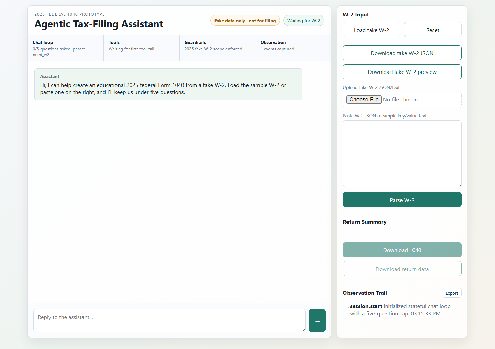
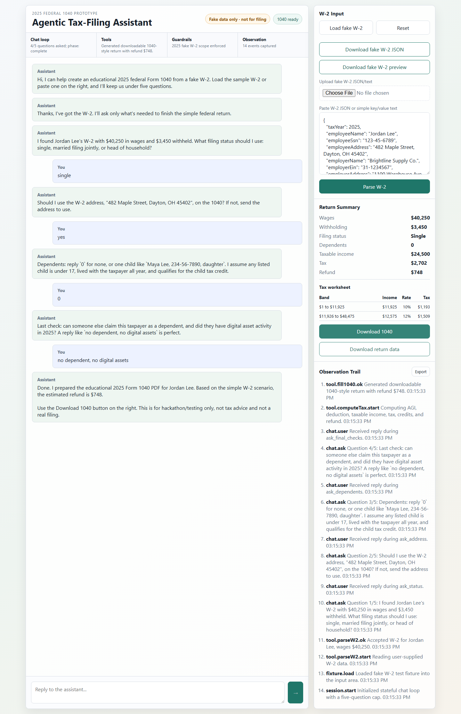

# Gauntlet Hackathon Tax Assistant

A small static web app for the Gauntlet hackathon challenge: a web-based chat that turns a fake 2025 W-2 into a downloadable educational 2025 IRS Form 1040 PDF.

## Live Demo

- App: `https://tylerxia8.github.io/gauntlet-tax-assistant/`
- Source: `https://github.com/tylerxia8/gauntlet-tax-assistant`

## Quick Demo

1. Click **Load fake W-2**, then **Parse W-2**.
2. Reply `single`, `yes`, `0`, then `no dependent, no digital assets`.
3. Confirm **1040 ready**, review the worksheet, and click **Download 1040**.
4. The generated PDF is visibly stamped as fake-data educational output and not for filing.

## Screenshots





## Local Run

Serve the folder:

```sh
npm install
npm start
```

Then open `http://localhost:4173`. No backend API key is required. The local server is needed so the browser can fetch the bundled IRS PDF template.

## Test Flow

1. Click **Load fake W-2**.
2. Click **Parse W-2**.
3. Answer the chat questions, for example:
   - `single`
   - `yes`
   - `0`
   - `no dependent, no digital assets`
4. Click **Download 1040**.

The right panel shows the harness observation trail: chat events, tool calls, guardrail decisions, and the final form-generation action.

For a fuller walkthrough, see [`JUDGE_SCRIPT.md`](./JUDGE_SCRIPT.md).
For tax assumptions and limitations, see [`TAX_NOTES.md`](./TAX_NOTES.md).

## Tests

Install the Playwright browser once, then run the full suite:

```sh
npx playwright install chromium
npm test
```

The suite includes DOM harness tests, PDF field-map checks, and a Chromium E2E test that drives the chat and verifies the 1040 PDF download.

Useful judge controls:

- **Download fake W-2 JSON** saves the bundled test W-2 fixture.
- **Upload fake W-2 JSON/text** lets you provide the same fixture or another bounded fake W-2 as a local file.
- **Download return data** saves the computed values, answers, scope flags, and observation trail after the return is ready.
- **Export** in the observation panel saves the full event trail as JSON.
- The four-pillar strip above the chat shows live harness state for chat loop, tools, guardrails, and observation.
- The return summary includes a bracket-by-bracket tax worksheet once the 1040 is ready.
- Corrections work after completion. For example: `change filing status to head of household` or `change dependents to Maya Lee, 234-56-7890, daughter`.

## Deployment

This can be deployed as a static site. On Render, create a **Static Site** with:

- Build command: `npm install`
- Publish directory: `.`

The app uses `vendor/pdf-lib.min.js` and `assets/f1040-2025.pdf` at runtime, so no server process is required.

The included `render.yaml` captures the same static deployment settings.

## Scope

This is an educational hackathon prototype only. It uses fake W-2 data, performs a bounded 2025 federal W-2-only calculation, supports zero or one qualifying child under simplified assumptions, and does not provide tax advice, e-file, or handle real PII. The PDF template is the IRS Form 1040 downloaded from `https://www.irs.gov/pub/irs-pdf/f1040.pdf`.
